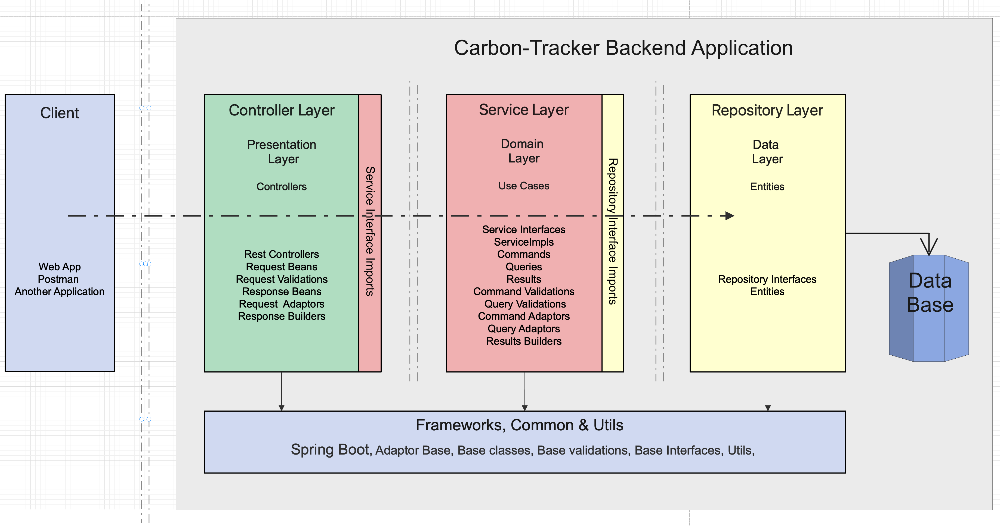
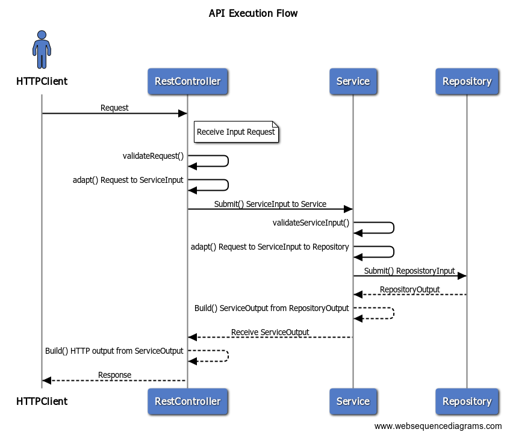
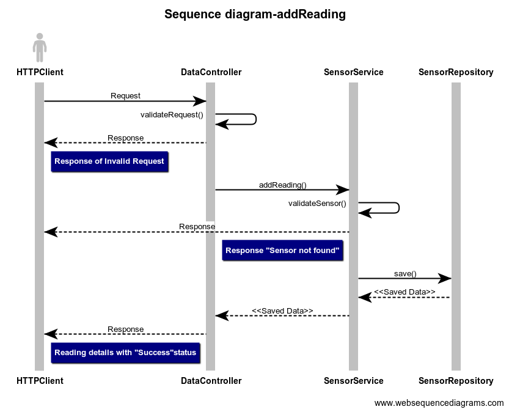
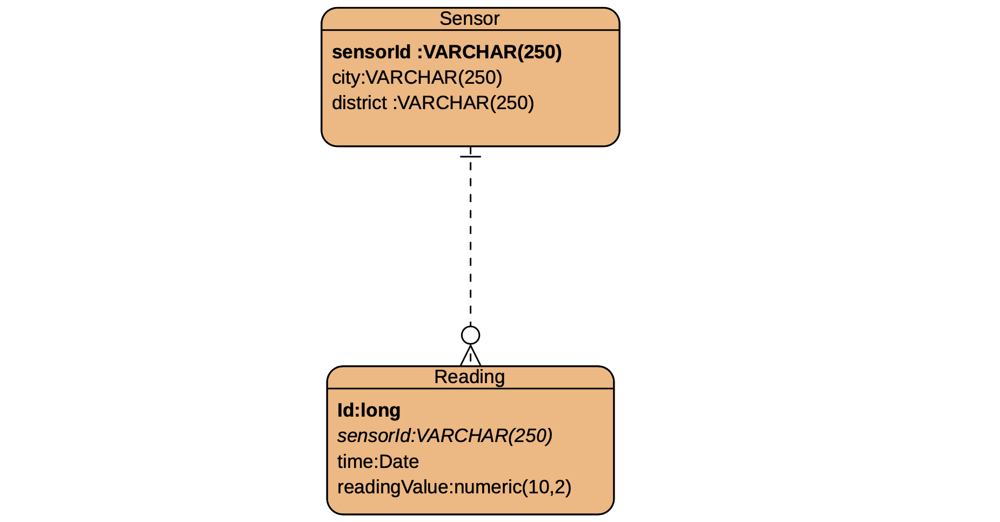
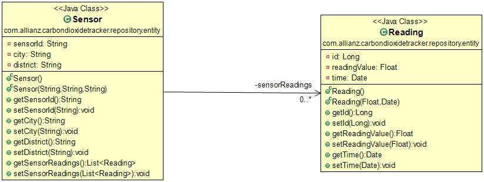

## About Carbon-Tracker
Carbon-Tracker expose the HTTP Rest API end points for tracking the Co2 values .
This facilitate to keep track of the levels of CO2 across several city ,districts which is collected from various sensors installed across city.

### Goals
* Simple, flexible, extendable Co2 values tracker backend System

<!-- ### Design Inspiration Architecture from Industry Standard

 -->

### Carbon-Tracker Application Prerequisites
<!-- **H2**  -->
1. Configure DB properties like H2 host, credentials etc.
2. Update the property `spring.datasource.url` `spring.datasource.driverClassName` `spring.datasource.username` `spring.datasource.password` `spring.h2.console.path`  **H2** and **JPA** will support this.
3. API endpoint to update sensor details such as `sensorId`, `city` and `districts` are not exposed in this project. This information should be provided manually in H2 database as a prerequisite once the project is running. Then the other api's for adding and retrieving Reading deatails can be performed.
4. Application is using filebased H2 databse, so the correct driver details should be updated in the H2 web UI login page.

### Carbon-Tracker Application Architecture

### API Execution Flow

### Add Reading API

### Get Reading API

### Entity Diagrams

### Class Diagram

### Swagger Link 
[Carbon-Tracker-swagger](https://xxyyy/).

<!-- 6. XXXX [dbconfig](./docs/images/CleanArchitecture.jpg) 
7. YYYY [dbconfig](./docs/images/CleanArchitecture.jpg)    -->
